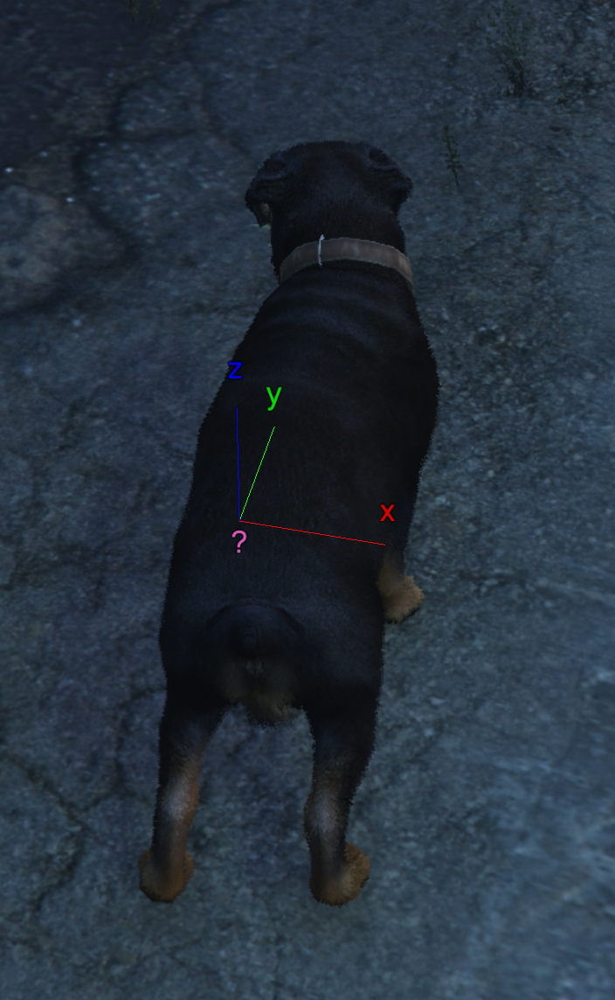
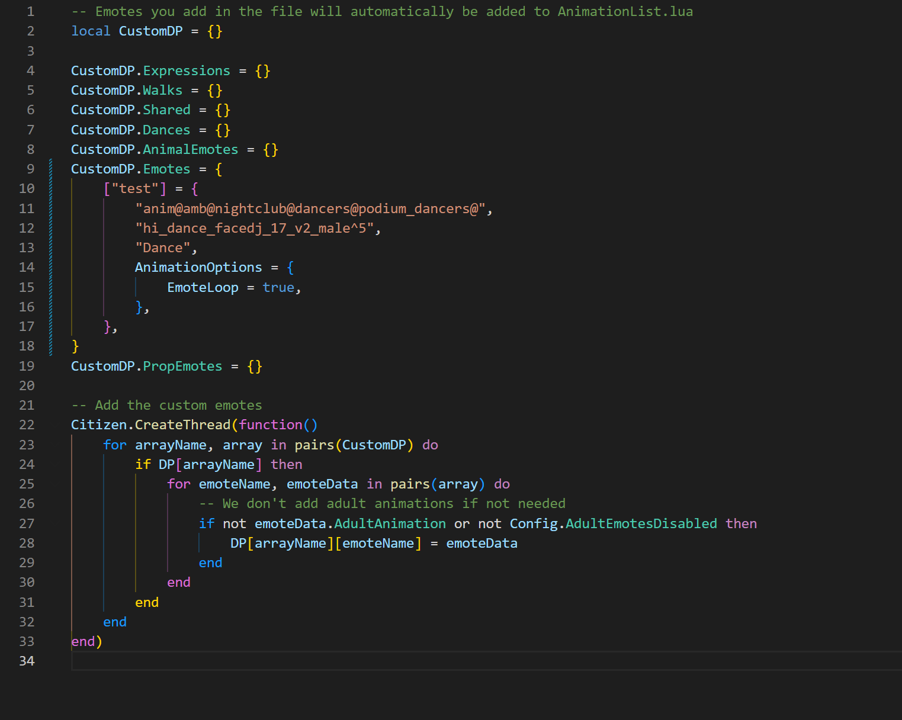

# NeganEmotes

**NeganEmotes** es un fork modificado no oficial de [rpemotes-reborn](https://github.com/alberttheprince/rpemotes-reborn), mantenido por **DevNeganSmith** para uso interno en un servidor privado de FiveM.

## Atribución del proyecto

- **Proyecto original:** rpemotes-reborn
- **Repositorio original:** https://github.com/alberttheprince/rpemotes-reborn
- **Mantenedor del fork / modificaciones:** DevNeganSmith
- **Licencia del código fuente:** GNU General Public License v3.0 (GPL-3.0)

Este repositorio contiene modificaciones y personalizaciones realizadas sobre rpemotes-reborn. NeganEmotes **no es el repositorio oficial de rpemotes-reborn** y no se presenta como un proyecto respaldado o avalado por los mantenedores originales.

Las partes del código fuente derivadas de rpemotes-reborn continúan sujetas a GPL-3.0. Las animaciones, props, modelos, texturas y otros recursos de terceros pueden estar sujetos a permisos o restricciones independientes y **no se presentan como creaciones de DevNeganSmith salvo que se indique expresamente**.

## Uso previsto

Este fork se mantiene **únicamente para uso interno del servidor**. No está pensado para ser vendido, redistribuido comercialmente ni presentado como un paquete original de recursos. Los nombres de las carpetas utilizados para organizar archivos no indican autoría ni propiedad sobre los recursos contenidos en ellas.

Consulta [ASSET_NOTICE.md](ASSET_NOTICE.md) para ver el aviso relacionado con los recursos de terceros.

---

# Características 🛠️

- Vista previa y colocación de emotes: visualiza y coloca los emotes antes de utilizarlos.
- Banner personalizable: cambia la imagen, el texto y el color del texto.
- Función de búsqueda de emotes 🔎
- Animaciones personalizadas aportadas por la comunidad 🕺
- Emotes grupales: bailes, saludos y más para 2 o más personas.
- Emotes de salida: finaliza los emotes con transiciones más suaves.
- Expresiones faciales y estilos de caminar persistentes mediante KVP del cliente.
- Conversión sencilla de Menyoo a RPEmotes 🔄
- Posibilidad de ocultar emotes para adultos 🔞
- Posibilidad de ocultar emotes de animales ⛔
- Emotes de animales 🐩
- Efectos de partículas compartidos: humo, fuego y más 💨
- Compatibilidad con QB-Core + ESX y asignaciones de teclas mediante KVP ⚙️
- Compatibilidad con poses y animaciones compartidas o de pareja 👫
- Desactivación persistente de la cámara inactiva mediante KVP 🎥
- Archivo de configuración fácil de entender ⚙️
- Extractor de props para scripts anticheat 💾
- Agacharse 🐞
- Arrastrarse 🐛
- Señalar con el dedo 👆
- Ragdoll 😵
- Levantar las manos 🙌
- Binoculares funcionales 👀
- Cámara de noticias 🎤📹

**Idiomas disponibles:**

Albanés, portugués de Brasil, chino simplificado, chino tradicional, checo, danés, neerlandés, inglés, finés, francés, alemán, griego, húngaro, indonesio, italiano, lituano, noruego, persa, polaco, rumano, ruso, serbio, cingalés, esloveno, español, sueco, turco y vietnamita.

Los idiomas se pueden seleccionar y/o añadir desde `config.lua`.

Las traducciones han sido realizadas o aportadas por la comunidad de FiveM; algunas pudieron apoyarse en traducción automática.

El inglés es el idioma original y normalmente contiene primero las cadenas más recientes. Algunas traducciones pueden estar incompletas o tener diferencias de calidad. Si falta una cadena, el inglés puede utilizarse como idioma de respaldo. Compara tu archivo de idioma con el archivo en inglés para localizar y añadir traducciones faltantes.

Si encuentras una traducción incorrecta o quieres añadir otro idioma, puedes realizar los cambios correspondientes en tu fork.

# Exports y documentación

Puedes consultar la documentación original [aquí](https://rpemotes-reborn.gitbook.io/guide).

El recurso rpemotes-reborn dispone de los siguientes exports:

```lua
exports["rpemotes-reborn"]:EmoteCommandStart(emoteName, textureVariation) -- Obsoleto; se recomienda usar Execute() de abajo
exports["rpemotes-reborn"]:Execute(emoteName, emoteType, textureVariation) -- Ejecuta cualquier tipo de emote mediante su controlador nativo
exports["rpemotes-reborn"]:EmoteCancel(forceCancel) -- forceCancel es opcional
exports["rpemotes-reborn"]:IsPlayerCrouched()
exports["rpemotes-reborn"]:IsPlayerProne()
exports["rpemotes-reborn"]:StopPlayerProne(force) -- force es opcional
exports["rpemotes-reborn"]:GetPlayerProneType() -- Devuelve el tipo de posición en el suelo: "onfront" o "onback"
exports["rpemotes-reborn"]:IsPlayerCrawling()
exports["rpemotes-reborn"]:IsPlayerPointing()
exports["rpemotes-reborn"]:IsPlayerInAnim() -- Devuelve el nombre de la animación actual o nil
exports["rpemotes-reborn"]:IsPlayerInHandsUp()
exports["rpemotes-reborn"]:toggleBinoculars()
exports["rpemotes-reborn"]:toggleNewscam()
exports["rpemotes-reborn"]:getWalkstyle() -- Obtiene el estilo de caminar del jugador
exports["rpemotes-reborn"]:setWalkstyle(name, force) -- Permite establecer o forzar un estilo de caminar; force es opcional
exports["rpemotes-reborn"]:toggleWalkstyle(bool, message) -- Permite o impide cambiar el estilo de caminar; message es opcional
exports["rpemotes-reborn"]:GetEmoteCatalog() -- Devuelve el catálogo combinado de emotes, compartidos, expresiones, estilos y emojis
```

`GetEmoteCatalog()` es un export de cliente pensado para recursos de menú externos. Devuelve `nil, "catalog_not_ready"` hasta que se haya convertido la lista de animaciones. Después devuelve una lista almacenada en caché, que solo se reconstruye cuando se vuelve a convertir la lista, por lo que puede llamarse repetidamente de forma segura.

El resultado es un arreglo plano con todos los emotes, emotes compartidos, expresiones, estilos de caminar y emojis. Cada entrada incluye `name` y `emoteType`, además de los campos internos generados durante la conversión, como `dict`, `anim`, `label`, `scenario`, `AnimationOptions`, etc. Las entradas de emoji incluyen `name`, `emoteType` y `emoji`. La estructura sigue los datos internos de RPEmotes para que otros recursos puedan adaptarla a su propio modelo.

Si tienes problemas con jugadores utilizando emotes donde no deberían, puedes controlar su uso mediante estados del jugador. Por ejemplo, puedes impedir emotes cuando un jugador está encarcelado, esposado o siendo escoltado. También puedes impedir que cancele una animación.

```lua
LocalPlayer.state:set('canEmote', false, true) -- Impide que el jugador use emotes
LocalPlayer.state:set('canEmote', true, true) -- Permite que el jugador use emotes

LocalPlayer.state:set('canCancel', false, true) -- Impide cancelar el emote
LocalPlayer.state:set('canCancel', true, true) -- Permite cancelar el emote
```

# Tecla del menú 🎛️

La asignación utiliza `RegisterKeyMapping`. La tecla configurada inicialmente en `config.lua` será la predeterminada. Una vez que un jugador cambie su tecla, FiveM conservará su elección y podrá modificarla desde los ajustes de teclas de FiveM.

**Tecla del menú:**

| COMANDO | ACCIÓN |
| --- | --- |
| F4 | Abrir / cerrar el menú de RPEmotes |

Los propietarios del servidor pueden modificarla desde `config.lua`.

Los jugadores también pueden cambiar la asignación desde:

`Esc > Ajustes > Asignación de teclas > FiveM`

Más funciones utilizan ahora asignaciones de teclas configurables desde FiveM, como `RagdollKeybind`.

# Asignaciones de teclas 🎛️

Para utilizar las funciones de asignación de teclas, activa la opción correspondiente en `config.lua`:

```lua
Keybinding = false,
```

También puedes usar el comando de bind incluido en FiveM sin utilizar SQL. Escribe lo siguiente en F8:

`bind keyboard "Yourbutton" "e youremote"`

Para eliminar una asignación:

`unbind keyboard "Yourbutton"`

# Personalización del menú: cabecera

Para editar la cabecera, busca la imagen correspondiente en el directorio principal del recurso y modifícala con el programa que prefieras. Las dimensiones recomendadas son **512 x 128**.

No cambies el nombre del archivo de imagen si el recurso sigue haciendo referencia a ese nombre.

Ejemplo de banner:


**Nota para usuarios de versiones antiguas de RPEmotes:** anteriormente el banner podía alojarse mediante un enlace web. Algunos servicios de alojamiento de imágenes han limitado el acceso debido al volumen de tráfico generado por FiveM, por lo que se recomienda utilizar el archivo local.

# Personalización del menú: título

En `config.lua`, el propietario del servidor puede configurar `MenuTitle` o dejarlo vacío. Lo recomendable es utilizar 11 caracteres o menos y evitar espacios cuando sea posible.

También puedes configurar la fuente, decidir si quieres contorno y establecer `MenuPosition`.

Fuentes disponibles:

```lua
    -- 0 : Chalet London
    -- 1 : House Script
    -- 2 : Monospace
    -- 4 : Chalet Comprime Cologne
    -- 7 : Pricedown
```

Hay más opciones de personalización en la configuración. Debido a determinadas limitaciones de servicios externos, algunas imágenes no pueden enlazarse directamente desde plataformas como Imgur o Discord. Puedes utilizar una imagen alojada en una fuente compatible o dejar el campo vacío.

# Desplazamiento por incrementos

Al mantener pulsado `LEFT ALT`, los jugadores pueden desplazarse por el menú elemento por elemento o en incrementos mayores.

También pueden utilizar el botón `SHARE` en un mando de Xbox o `OPTIONS` en un mando de PlayStation.

# Ragdoll 🥴

- Para activar ragdoll, cambia `RagdollEnabled = false` a `true` en `config.lua`.
- `RagdollKeybind` utiliza `RegisterKeyMapping`. La tecla predeterminada puede cambiarse desde los ajustes de teclas de FiveM.
- La opción `RagdollAsToggle` permite elegir entre funcionamiento tipo interruptor o mantener pulsada la tecla.

# Señalar y levantar las manos 👆

Una vez activadas estas funciones, los jugadores pueden pulsar `B` para señalar y `Y` para levantar las manos, sin necesidad de instalar recursos adicionales.

Estas teclas pueden modificarse según las preferencias del servidor.

| COMANDO | ACCIÓN |
| --- | --- |
| B | Activar / desactivar señalar |
| Y | Activar / desactivar levantar las manos |
| /pointing | Activar / desactivar señalar |
| /handsup | Activar / desactivar levantar las manos |

# Agacharse y arrastrarse

**Agacharse:**

Con la tecla configurada para agacharse, el jugador puede desplazarse hacia delante, atrás y a los lados, además de girar. Según la configuración de la versión, también puede alternar posiciones al pulsar la barra espaciadora.

**Arrastrarse:**

El servidor puede configurar el comportamiento de la tecla correspondiente para alternar entre sigilo, agacharse y arrastrarse, según las opciones de `config.lua`.

# Comandos de chat

| COMANDO | ACCIÓN |
| --- | --- |
| LEFT CONTROL | Activar / desactivar agacharse |
| RIGHT CONTROL | Activar / desactivar arrastrarse |
| /crouch | Activar / desactivar agacharse |
| /crawl | Activar / desactivar arrastrarse |

---

# Estados de ánimo y estilos de caminar 😜🚶‍♂️

Los estados de ánimo y estilos de caminar pueden seleccionarse desde el menú. Se guardan mediante KVP del cliente y pueden volver a aplicarse al salir de un vehículo o al volver a entrar al servidor.

| COMANDO | ACCIÓN |
| --- | --- |
| F4 | Abre el menú de RPEmotes |
| /walks | Muestra una lista de estilos de caminar en el chat |
| /moods | Muestra una lista de estados de ánimo en el chat |
| /reset mood | Elimina el estado de ánimo guardado y restaura el predeterminado |
| /reset walk | Elimina el último estilo de caminar y restaura el predeterminado |

Si algunos usuarios abusan de determinados estilos de caminar, rpemotes-reborn puede detectar ciertos estilos considerados problemáticos y limpiarlos al entrar. Como alternativa, puedes utilizar un recurso como [rpemotes-punishment](https://github.com/alberttheprince/rpemotes-punishment/).

Si simplemente quieres eliminarlos, puedes retirar de `AnimationList.lua` estilos como:

Bigfoot, Hurry, Hurry2, Hurry3, Flee, Flee2, Flee3, Flee4 y Flee5.

# Animaciones inactivas y cámara inactiva 📷

Por defecto, rpemotes-reborn incluye anulaciones de determinadas animaciones inactivas para evitar algunos movimientos aleatorios de los peds de GTA mientras permanecen quietos.

Para restaurarlas, elimina la carpeta:

`stream/[Custom Emotes]/noidleanimations/`

La opción de cámara inactiva permite controlar la cámara automática tanto a pie como dentro de vehículos.

| COMANDO | ACCIÓN |
| --- | --- |
| /Idlecamon | Desactiva el comportamiento nativo |
| /idlecamoff | Activa el comportamiento nativo |

# Binoculares 👀

| COMANDO | ACCIÓN |
| --- | --- |
| /binoculars | Inicia los binoculares |
| L ALT | Alterna entre visión nocturna, térmica y normal |
| G | Muestra u oculta las instrucciones |
| BACKSPACE | Cierra los binoculares |

# Cámara de noticias

| COMANDO | ACCIÓN |
| --- | --- |
| /newscam | Inicia la cámara de noticias |
| H | Edita el texto |
| L ALT | Alterna entre los modos de visión |
| G | Muestra u oculta las instrucciones |
| BACKSPACE | Cierra la cámara |

# Emotes de salida

Los emotes de salida permiten cancelar una animación de forma más suave y dinámica; por ejemplo, levantarse de una silla o realizar una transición antes de finalizar una acción.

Puedes añadir tus propios emotes de salida en el nuevo arreglo `CustomDP.Exits = {}` de `AnimationListCustom.lua`.

Ejemplo:

```lua
    },
    ["sit"] = {
        "anim@amb@business@bgen@bgen_no_work@",
        "sit_phone_phoneputdown_idle_nowork",
        "Sit",
        AnimationOptions = {
            onFootFlag = AnimFlag.LOOP,
            ExitEmote = "getup",
        }
    },
```

En este ejemplo, `ExitEmote` llama al emote `getup`:

```lua
["getup"] = {
        "get_up@sat_on_floor@to_stand",
        "getup_0",
        "Get Up",
        AnimationOptions = {
            EmoteDuration = 2000
        }
    }
}
```

# Emotes para adultos 🔞

Los emotes marcados como contenido para adultos pueden ocultarse del menú configurando:

`AdultEmotesDisabled = true`

en `config.lua`.

Esto impide que los emotes marcados como `AdultAnimation` aparezcan en las listas del menú durante el inicio del recurso.

También puedes configurar el recurso para ocultar emotes de animales.

# QB-Core ⚙️

**Integración con QBCore compatible con el enfoque utilizado por el fork de dpemotes.**

Si utilizas qb-core, configura:

```lua
Framework = "qb-core",
```

Si no lo utilizas, deja:

```lua
Framework = false,
```

Dependiendo de la versión de tu framework, puede ser necesario adaptar alguna parte de la integración.

# Extractor de props ↔️

Algunos servidores utilizan anticheats que pueden detectar props generados por los emotes. Para facilitar la creación de listas permitidas, RPEmotes incluye un comando capaz de generar automáticamente un archivo llamado `prop_list.lua`.

### Comando

`emoteextract`

```text
Formatos de salida disponibles:
1 - 'prop_name',
2 - "prop_name",
3 - prop_name
4 - calcular el total de emotes

Ejemplo de uso: emoteextract 1
```


# Instrucciones de instalación ⚙️

- Añade `ensure rpemotes` a tu `server.cfg`.
- Descarga los artifacts recomendados más recientes para [Windows](https://runtime.fivem.net/artifacts/fivem/build_server_windows/master/) o [Linux](https://runtime.fivem.net/artifacts/fivem/build_proot_linux/master/).
- Utiliza un game build compatible y actualizado para que los emotes y props funcionen correctamente.
- **OneSync Infinity es necesario para que determinados efectos de partículas funcionen correctamente entre jugadores.**

En servidores locales, la configuración puede incluir:

```text
+set onesync on +set onesync_enableInfinity 1 +set onesync_enableBeyond 1 +set onesync_population true
```

Puedes colocar estas opciones antes de la configuración de `sv_enforceGameBuild`.

- Configura el idioma deseado en `config.lua`, por ejemplo: `MenuLanguage = 'es'`.
- Si utilizas QB-Core, establece `Framework = 'qb-core'`. En caso contrario, déjalo en `false`.
- Si no deseas utilizar las funciones KVP de asignación de teclas, puedes utilizar los comandos de bind de FiveM desde F8.
- Después de realizar cambios, utiliza `/refresh` y `/ensure rpemotes`, o simplemente reinicia el servidor.

# Emotes compartidos 👩🏻‍❤️‍💋‍👨🏼

Los emotes compartidos pueden utilizar `SyncOffset` o `Attachto`.

Si utilizan `SyncOffsetFront` o `SyncOffsetSide`, el desplazamiento aplicado corresponde normalmente al jugador que inició el emote.

Por ejemplo, si el jugador 1 inicia `handshake` y este utiliza `SyncOffsetFront`, el desplazamiento se aplica al jugador que inició la animación según la configuración del emote.

- Con `Attachto`, pueden utilizarse los datos de uno de los jugadores para adjuntar al otro.
- Si el jugador 1 inicia una animación como `carry`, el otro jugador puede quedar adjuntado dependiendo de cuál de las dos animaciones contenga `Attachto`.
- Si el jugador inicia directamente la contraparte, como `carry2`, puede invertirse qué jugador queda adjuntado.

En la mayoría de los casos, el jugador que inicia la animación será quien determine la colocación inicial.

**Caso especial:** si ambos emotes utilizan `Attachto`, normalmente solo se adjuntará el jugador que inició el emote según la lógica implementada.

Puedes consultar una lista de huesos de ped en [Ped Bones](https://wiki.rage.mp/index.php?title=Bones).

Debes utilizar el ID del hueso correspondiente, por ejemplo `1356`, y no confundirlo con otros índices internos.

Si esta configuración te resulta confusa, normalmente es más sencillo trabajar con el enfoque basado en `Attachto`.

# Efectos de partículas 💨

**REQUIERE ONESYNC INFINITY**

Puedes localizar efectos de partículas utilizando el [DurtyFree GTA V Dump](https://github.com/DurtyFree/gta-v-data-dumps/blob/master/particleEffectsCompact.json).

Debes definir el asset de partículas, su nombre y su colocación. La colocación utiliza XYZ, Pitch, Roll, Yaw y escala.

OneSync es necesario para sincronizar correctamente estos efectos entre los clientes.

```lua
PtfxPlacement = {
    -0.15, -- X
    -0.35, -- Y
     0.0, -- Z
     0.0, -- ROTACIÓN X
     90.0, -- ROTACIÓN Y
     180.0, -- ROTACIÓN Z
       1.0 -- ESCALA
},
```



Por defecto, el prop principal puede compartir sus coordenadas con el efecto de partículas. En ese caso puedes comenzar utilizando valores `0.0` y ajustarlos según sea necesario.

Si la animación no utiliza prop o necesitas colocar el efecto en otra posición, utiliza `PtfxNoProp = true`. Como referencia, los primeros tres valores corresponden a XYZ y los tres siguientes a la rotación XYZ.

También puedes utilizar la opción `PtfxBone` de `AnimationOptions` para adjuntar el efecto PTFX a un hueso del ped, de forma similar a como se adjuntan los props.

Con Menyoo puedes generar un objeto sencillo, adjuntarlo al ped y utilizarlo como referencia para ajustar las coordenadas hasta encontrar la colocación deseada. Después puedes trasladar esos valores a RPEmotes.

Ten en cuenta que `ptfxwait` se expresa en milisegundos. Por ejemplo, para una duración de 30 segundos:

`ptfxwait = 30000`

# Añadir tus propias animaciones ⚙️

Como el menú puede actualizarse con frecuencia, algunos archivos pueden sobrescribirse. Para evitar perder personalizaciones, coloca tus animaciones propias o descargadas `(.ycd)` en una carpeta creada específicamente dentro de:

`rpemotes\stream\[Custom Emotes]`

Añade el código de tus animaciones en `AnimationListCustom.lua` y conserva una copia de seguridad, por ejemplo:

`BackUpAnimationListCustom.lua`

**Nota sobre emotes en vehículos:** si quieres reproducir un emote de cuerpo completo dentro de un vehículo, añade la opción correspondiente de cuerpo completo en la configuración del emote.

**Nota sobre emotes de animales:** para añadir animaciones personalizadas destinadas a peds animales, utiliza las etiquetas correspondientes, como `sdog` o `bdog`, de acuerdo con la implementación del recurso. También debes registrar los peds addon correspondientes en el archivo de animales para permitir que esas animaciones se reproduzcan en esos modelos.

Después de una actualización, puedes volver a copiar tus cambios desde la copia de seguridad a la versión nueva de `AnimationListCustom.lua`.

Los archivos `AnimationListCustom.lua` de versiones muy antiguas pueden no ser compatibles directamente con versiones más recientes. Lo más seguro es copiar únicamente tus personalizaciones al archivo incluido en la versión actual.

También se recomienda conservar una copia de seguridad de `config.lua`.

Ejemplo:



# Créditos 🤝

**Todas** las animaciones y props personalizados incluidos originalmente por el proyecto fueron añadidos con permiso de sus respectivos creadores.

Los creadores de animaciones indicaron **expresamente** que su contenido debía permanecer gratuito y que el equipo y la comunidad de RPEmotes no debían intentar obtener beneficios con él, reclamarlo como propio ni volver a subirlo a otros lugares.

**Un enorme agradecimiento a las siguientes personas y comunidades por sus contribuciones al menú:**

- La comunidad de FiveM por utilizar RP y contribuir a la evolución de rpemotes-reborn.

### Desarrolladores

- [The Popcorn RP community](https://discord.gg/popcornroleplay), por colaborar en las pruebas y resolución de problemas.
- [Mathu_lmn](https://github.com/Mathu-lmn), por mantener el menú y añadir funciones.
- [Manason](https://github.com/Manason), por importantes reestructuraciones, refactorizaciones y mejoras durante la transición a la versión 2.0.
- [CritteRo](CritteRo), por su trabajo en la colocación de emotes compartidos y otras mejoras.
- [ChristopherM](https://github.com/cm8263), por crear la función de colocación de emotes y realizar correcciones.
- [enzo2991](https://github.com/enzo2991), por crear la vista previa de peds y funciones de teclas con KVP.
- [DerDevHD](https://forum.cfx.re/t/fixed-remove-prop-after-scenario-animation/5002332/8), por sus aportes relacionados con la eliminación de props de escenarios.
- [iSentrie](https://forum.cfx.re/u/isentrie/), por código adicional, soporte y colaboración con el proyecto.
- [Kibook](https://github.com/kibook), por añadir el submenú de emotes de animales.
- [AvaN0x](https://github.com/AvaN0x), por reformatear código, añadir funciones y ayudar con los efectos de partículas compartidos.
- [Mads](https://github.com/MadsLeander), por unirse al equipo como codesarrollador.
- [Tigerle](https://forum.cfx.re/u/tigerle_studios), por aportar código adicional para los emotes compartidos.
- [GeekGarage](https://github.com/geekgarage), por su conocimiento, tiempo y dedicación en nuevas funciones.
- [northsqrd](https://github.com/0sqrd), por añadir la búsqueda, configuración de emotes animales, variantes de texturas y otras contribuciones.
- [Chico](https://forum.cfx.re/u/chico), por implementar natives para reaplicar estados de ánimo y estilos de caminar persistentes en ESX y QB-Core.
- [Scully](https://github.com/Scullyy/), por su trabajo anterior en RPEmotes.
- [DevNeganSmithStore](https://dev-negan-smith-store.tebex.store), por apoyo en pruebas.
- Crusopaul y Eki, por sus aportes relacionados con KVP y estilos de caminar persistentes.

### Creadores de emotes y props

- [FalseHopeDesigns](https://falsehopedesigns.tebex.io/), por la creación de props sin colisión.
- [SMGMissy](https://jenscreations.tebex.io/), por la creación de props de banderas Pride.
- [MissSnowie](https://www.gta5-mods.com/users/MissySnowie)
- [Smokey](https://www.gta5-mods.com/users/struggleville)
- [BzZzi](https://forum.cfx.re/u/bzzzi/summary)
- [Natty3d](https://forum.cfx.re/u/natty3d/summary)
- [Amnilka](https://www.gta5-mods.com/users/frabi)
- [LittleSpoon](https://discord.gg/safeword)
- [LadyyShamrockk](https://www.gta5-mods.com/users/LadyyShamrockk)
- [Pupppy](https://discord.gg/rsN35X4s4N)
- [SapphireMods](https://discord.gg/Hf8F4nTyzt)
- [QueenSisters Animations](https://discord.gg/qbPtGwQuep)
- DurtyFree, por su trabajo con efectos de partículas y catalogación de información de GTA: [DurtyFree GTA V Dump](https://github.com/DurtyFree/gta-v-data-dumps/blob/master/particleEffectsCompact.json)
- [BoringNeptune](https://www.gta5-mods.com/users/BoringNeptune)
- [CMG Mods](https://www.gta5-mods.com/users/-moses-)
- [prue 颜](discord.gg/lunyxmods)
- [PataMods](https://forum.cfx.re/u/Pata_PataMods)
- [Crowded1337](https://www.gta5-mods.com/users/crowded1337)
- [EnchantedBrownie](https://www.gta5-mods.com/users/EnchantedBrownie)
- Chocoholic Animations
- [CrunchyCat](https://www.gta5-mods.com/users/crunchycat)
- [KayKayMods](https://discord.gg/5bYQVWVaxG)
- [MonkeyWhisper](https://github.com/MonkeyWhisper) y [Project Sloth](https://github.com/Project-Sloth)
- [Brummieee](https://forum.cfx.re/u/brummieee_maps/summary)
- [Dark Animations](https://www.gta5-mods.com/users/Darks%20Animations)
- [-EcLiPsE-](https://www.gta5-mods.com/users/-EcLiPsE-), por permitir la implementación de [Improved Prop Sets](https://www.gta5-mods.com/misc/improved-propsets-meta) y [GTA Online Biker Idle Anims](https://www.gta5-mods.com/misc/bike-idle-animations)
- [MrWitt](https://www.gta5-mods.com/users/MrWitt)
- [Vedere](https://discord.gg/XMywAMQ8Ef)
- [DRX Animations](https://www.gta5-mods.com/users/DRX%2DAnimations)
- [VNSIanims](https://discord.gg/cTNrjYSXXG)
- [PNWParksFan](https://www.gta5-mods.com/users/PNWParksFan)
- [LSPDFR member Sam](https://www.lcpdfr.com/downloads/gta5mods/misc/23386-lspd-police-badge/)
- [GTA5Mods user Sladus_Slawonkus](https://www.gta5-mods.com/misc/lspd-police-badge-replace-sladus_slawonkus)
- [EP](https://github.com/EpKouhia)
- [TayMcKenzieNZ](https://github.com/TayMcKenzieNZ)
- [41anims](https://www.gta5-mods.com/users/41anims)
- [corbs](https://www.gta5-mods.com/users/corbs)
- [jaysigx](https://www.gta5-mods.com/misc/improved-umbrella)
- [Payzee](https://pazeee.tebex.io/)
